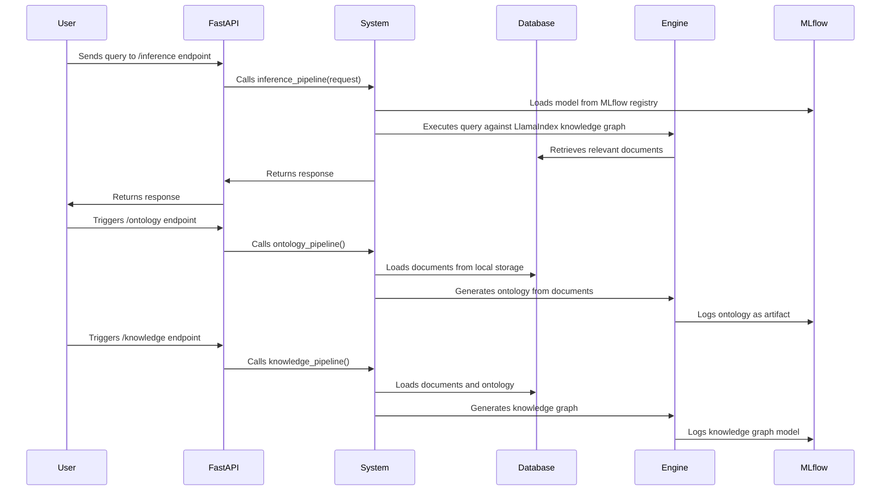

# Semantic-RAG-Search

## Overview

This project implements a Semantic RAG (Retrieval-Augmented Generation) search system. It leverages LlamaIndex, OpenAI, and MLflow to build a knowledge graph from a collection of documents, enabling semantic search and retrieval. The system includes components for ontology generation, knowledge indexing, and inference, with the goal of providing more accurate and context-aware search results.

## Key Features

- **Ontology Generation:** Extracts key concepts and relationships from documents to create an ontology.
- **Knowledge Graph Indexing:** Constructs a knowledge graph using the generated ontology and document content.
- **Semantic Search:** Enables users to perform semantic searches using a query engine built on top of the knowledge graph.
- **MLflow Integration:** Utilizes MLflow for experiment tracking, model management, and evaluation.
- **Image Description:** Generates textual descriptions for images using the OpenAI vision model.
- **API Endpoints:** Provides API endpoints for ontology creation, knowledge indexing, inference, and evaluation.

## Architecture

The system architecture can be visualized as follows:



## Requirements

```
fastapi==0.115.12
llama-index==0.12.30
llama-index-llms-openai==0.3.33
mlflow==2.21.3
networkx==3.4.2
pandas==2.2.3
pydantic==2.11.3
pydantic-settings==2.8.1
pyvis==0.3.2
seaborn==0.13.2
uvicorn==0.34.1
```

## Setup
1. Install dependencies:
```
pip install -r requirements.txt
```
2. Create a .env file in the src/config/ directory with the following variables:
```
OPENAI_API_KEY=<your_openai_api_key>
LOCAL_STORAGE_URL=<path_to_your_local_storage>
MLFLOW_HOST=<your_mlflow_tracking_uri>
MLFLOW_EXPERIMENT=<your_mlflow_experiment_name>
MLFLOW_MODEL=<your_mlflow_model_name>
SERVER_HOST=0.0.0.0
SERVER_PORT=8000
```
3. Run the application:
```
python src/main.py
```

## Usage
The application exposes the following endpoints:
- **HEAD /ontology**: Generates the ontology from the documents in the local storage.
- **HEAD /knowledge**: Generates the knowledge graph index from the documents and ontology.
- **POST /inference**: Performs inference on the knowledge graph using a given query. Requires a JSON payload {"query": "your_query"}.
- **HEAD /evaluation**: Evaluates the model using the data in the evaluation.csv file.

## Data Storage
The system uses a local storage directory to store documents and metadata. The directory structure is as follows:
```
<LOCAL_STORAGE_URL>/
├── document1.txt
├── document2.pdf
├── ...
└── .meta/
    ├── documents.csv
    └── ontology.csv
```

## Demonstration
### Ontology Visualization
The generated ontology can be visualized as an interactive network graph. This graph is created using the pyvis library and saved as an HTML file in your local storage directory ( settings.LOCAL_STORAGE_URL.get_secret_value() + '_visualisation.html').  The nodes represent concepts, and the edges represent relationships between them.  Node sizes are determined by their degree in the graph, and communities are identified using the Girvan-Newman algorithm, with each community assigned a unique color.
To view the visualization:
- Run the HEAD /ontology endpoint.
- Open the generated HTML file in your web browser.


### Evaluation Results
The evaluation pipeline uses MLflow to track and display the results of evaluating the model. Key metrics, such as latency, token count, and answer correctness, are logged during the evaluation process.
To view the evaluation results:
- Ensure you have an evaluation.csv file in the .meta directory within your local storage, containing query_str and ground_truth columns.
- Run the HEAD /evaluation endpoint.
- Access the MLflow UI at the specified tracking URI (settings.MLFLOW_HOST.get_secret_value()) to view the logged metrics and evaluation reports.


